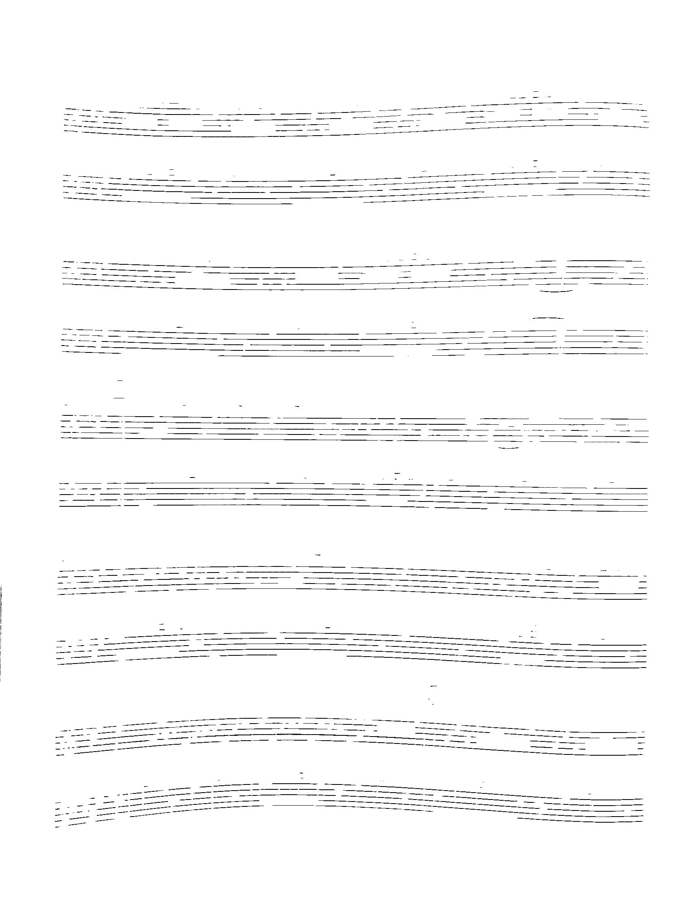
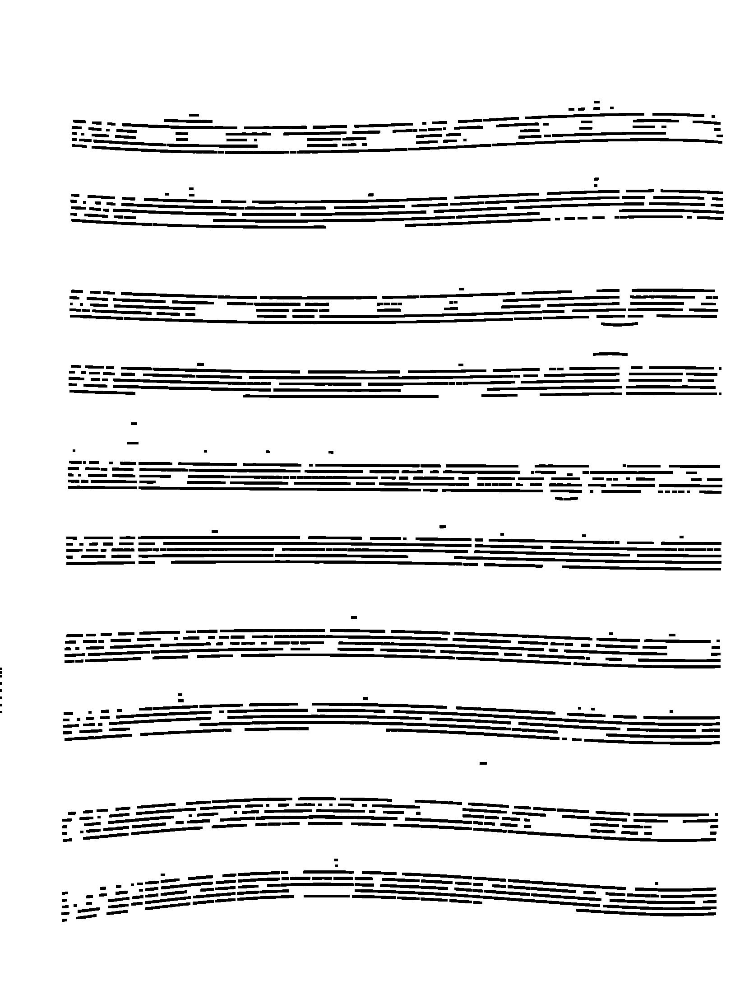
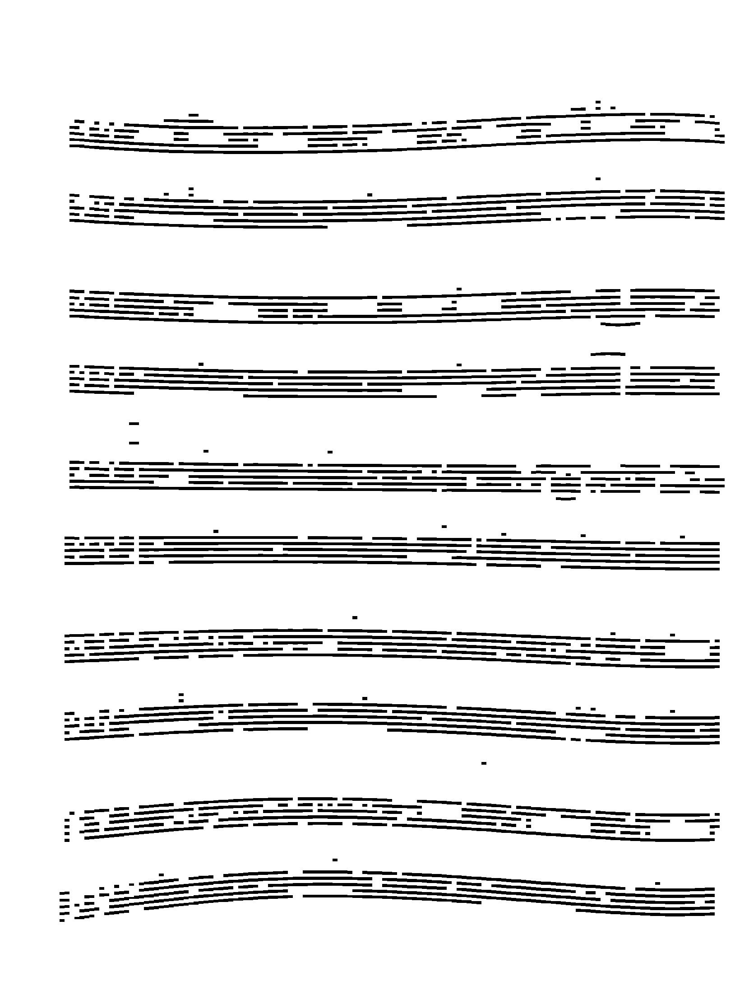
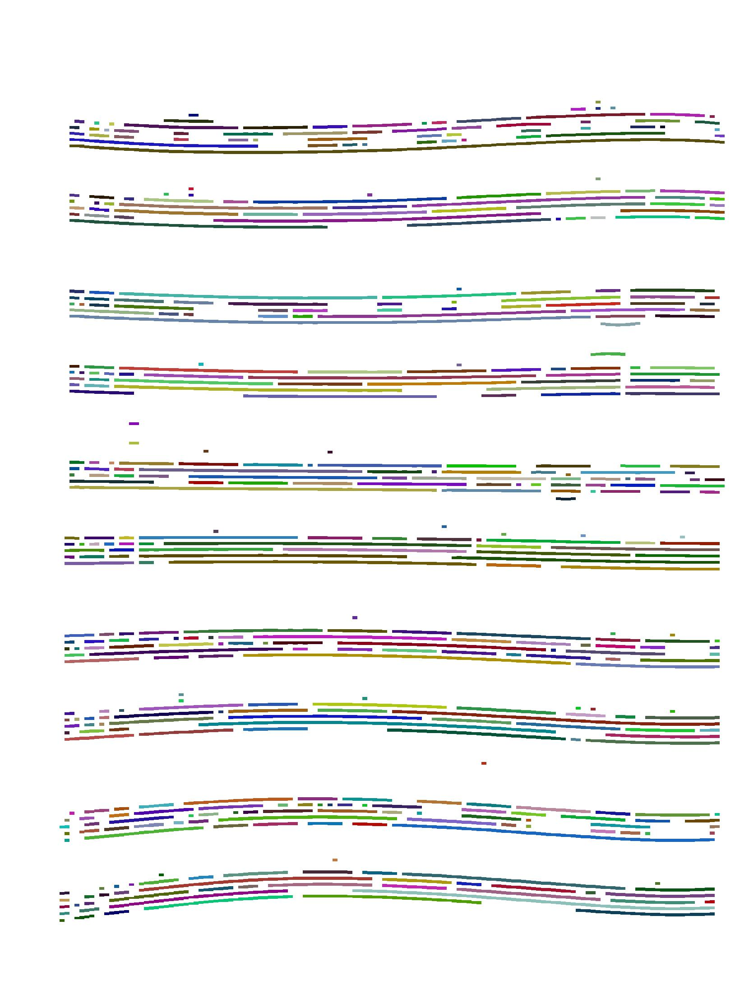
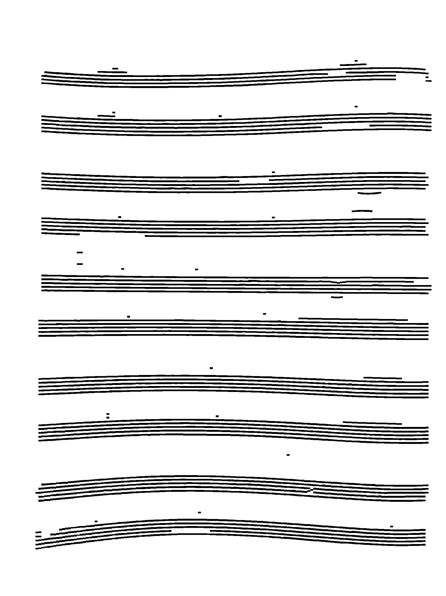
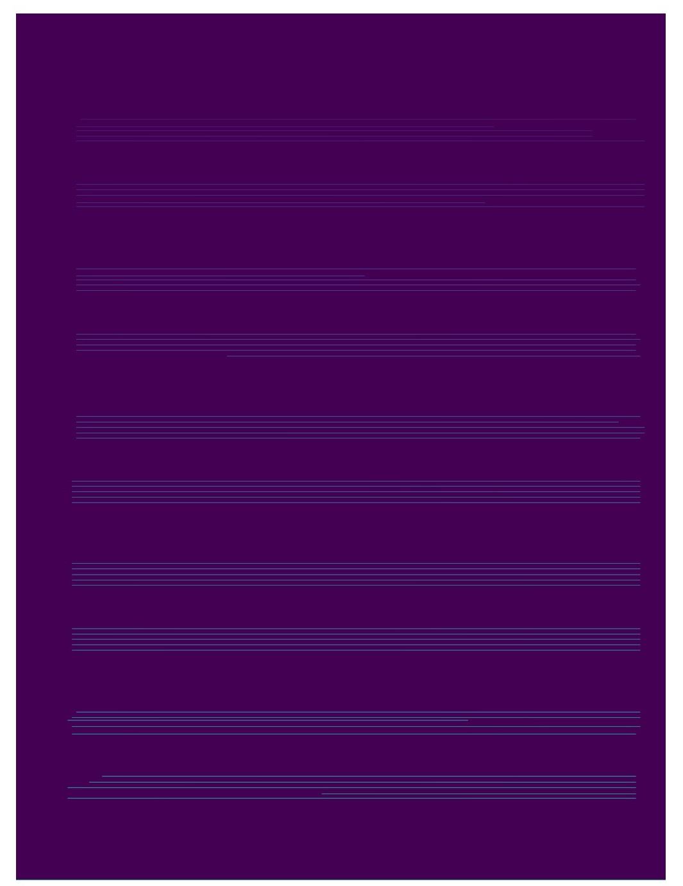
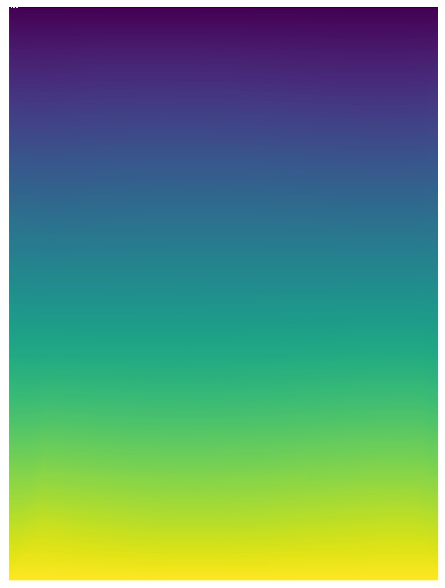
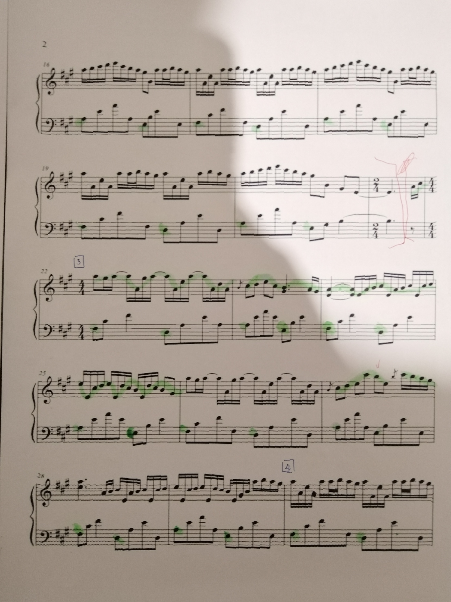

# Muskew

Music sheet deskewing: deskew/dewarp the curved music sheet photo with deep learning model. Directly process on raw photo input, and thus no need for the strict requirements on the input image. Just use it like you would do in daily life: take a photo of your favorite music sheet, pass it to `muskew`, and it will do all the rest of things for you, returns you with a plain, unwrapped image.

Notice that this is an independent part separated from [oemer](https://github.com/BreezeWhite/oemer), targeting for a more general usage scenarios without embbeded with the full pipeline of OMR.

**Attention!** Muskew does not handle 3D rotation, so make sure the sheet in the photo is roughly vertically and horizontally aligned.


## Quick Start

``` bash
pip install git+https://github.com/BreezeWhite/music-sheet-deskewing
muskew <path_to_image>
```

The output file will be stored to where the input file is, with postfix *_dewarp* added to the filename.


## Technical Details
Overview

1. Predict stafflines
2. Increase line width and morph out noises
3. Quantize the line into grids
4. Group the connected grids
5. Connect groups into lines
6. Build coordinate mappings (y-axis) of stafflines
7. Interpolate the mapping to all other positions
8. Apply the mapping


### Predict stafflines
The model was trained on [DeepScore-dense](https://tuggeluk.github.io/downloads/). Various transformations are applied while training
to make the model more robust to rotations, blurs, and different qualities of images.

Input Image:


Extracted stafflines


### Increase line width and morph out noises
To better infer the lines and quantize them in the next step, first increase the line width.



### Quantize the line into grids
Quantize the pixels into grids with information whether this grid contains the part of a line.




### Group the connected grids
Label each region into groups.



### Connect groups into lines
Starts from the widest group, infer the line trajectory on the left side by linear regression.
When hit a labeled group, adjust the trajectory by linear interpolation and fill in the infered
grids in between. The next round starts from the hitted group until there is no detected group anymore.



### Build coordinate mappings
Maps the x and y coordinates of the output file to the original input, e.g. mapping[x, y] = original[a, b].
This the actual adjustment happends, where the skewed y position are mapped to the same y position.
The new y position is calculated by the mean y positions in the connected groups.



### Interpolate the mapping
Since we now only have mappings on the positions of stafflines, we need to extend the mapping
to all other positions by interpolation. Here we use **linear interpolation** and not
**cubic interpolation**, which performs very differently and the former looks better on the result.



### Apply the mapping
Finally, we apply the mapping to the image.


